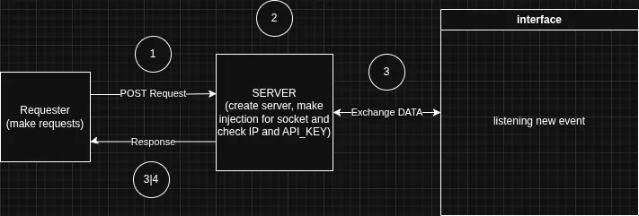

# Conduit — Parking Kiosk Server

A lightweight C++17 HTTP + WebSocket server that bridges your backend to a kiosk display screen in real time. Push any event over a single REST call; every connected browser receives it instantly through a persistent WebSocket.



---

## How it works

```
Backend  ──POST /event──►  Conduit  ──WebSocket──►  Browser (kiosk screen)
                            (C++)                      (Vue 3 UI)
```

1. Conduit starts and serves `web/index.html` with the `bridge.mjs` WebSocket client auto-injected.
2. The kiosk browser opens the page and connects to `ws://…/ws` automatically.
3. Your backend sends a `POST /event` with any event name and payload.
4. Conduit broadcasts the payload to every connected browser.
5. The Vue UI reacts and updates the display.

---

## Features

- **Zero dependencies to install** — `cpp-httplib` and `nlohmann/json` are header-only and already bundled under `include/`.
- **Auto-reconnecting WebSocket client** — `bridge.mjs` reconnects every 3 s on drop, invisible to the UI.
- **Bridge auto-injection** — `bridge.mjs` is injected into `<head>` at startup; no manual `<script>` tag needed in your HTML.
- **API-key auth** — every `POST /event` requires an `Authorization` header.
- **IP allowlist** — `config.json` accepts a list of allowed source IPs (`"*"` for any).
- **Self-generating config** — if `config.json` is missing, Conduit writes one with sane defaults and continues.
- **Cross-platform** — Linux, macOS, Windows (MSVC / MinGW).

---

## Project layout

```
kiosk/
├── CMakeLists.txt          # Build definition (project name: Conduit)
├── config.json             # Runtime config (auto-created if absent)
├── scheme.webp             # Architecture diagram
│
├── include/
│   ├── cpp-httplib/        # Header-only HTTP/WebSocket library
│   └── nlohmann/           # Header-only JSON library
│
├── src/
│   ├── cpp/
│   │   ├── main.cpp        # Entry point — loads config, starts server
│   │   ├── kioskserver.h   # KioskServer class declaration
│   │   └── kioskserver.cpp # HTTP routes, WebSocket hub, broadcast logic
│   └── js/
│       └── bridge.mjs      # WebSocket client injected into every page
│
├── web/
│   └── index.html          # Default parking display UI (Vue 3)
│
└── template/
    ├── parking/
    │   ├── index.html      # Same parking UI (copy for customisation)
    │   └── request.json    # Example POST /event payload
    └── alert/
        └── index.html      # Alert overlay UI (error / warning / success / info)
```

---

## Build

**Requirements:** CMake ≥ 3.16, a C++17-capable compiler, POSIX threads (Linux/macOS) or Winsock (Windows).

```bash
cmake -S . -B build
cmake --build build
```

The executable is `build/Conduit` (or `build/Conduit.exe` on Windows).

---

## Run

```bash
./build/Conduit
```

```
================================
         Conduit Server
================================
[INFO] http://localhost:8080
================================
[INFO] listening on 0.0.0.0:8080
```

Open `http://localhost:8080` in the kiosk browser. The green dot in the top-left confirms the WebSocket is live.

---

## Configuration

`config.json` is read from the directory that contains the executable. If it does not exist, Conduit creates it with the defaults below.

```json
{
  "identification": {
    "name": "main_screen"
  },
  "security": {
    "allowed_ips": ["*"],
    "api_key": "123456"
  },
  "server": {
    "host": "0.0.0.0",
    "port": 8080
  }
}
```

| Field                  | Description                                                |
| ---------------------- | ---------------------------------------------------------- |
| `identification.name`  | Logical name of this screen (informational)                |
| `security.api_key`     | Value that callers must pass in the `Authorization` header |
| `security.allowed_ips` | IP allowlist; `"*"` permits all                            |
| `server.host`          | Bind address (`0.0.0.0` = all interfaces)                  |
| `server.port`          | TCP port                                                   |

---

## API

### `GET /`

Returns `web/index.html` with `bridge.mjs` already inlined inside `<head>`. No authentication required.

---

### `POST /event`

Broadcast a named event to every connected WebSocket client.

**Headers**

| Header          | Required | Description                      |
| --------------- | -------- | -------------------------------- |
| `Content-Type`  | yes      | `application/json`               |
| `Authorization` | yes      | Must equal `api_key` from config |

**Body**

```json
{
  "event": "<event-name>",
  "message": {}
}
```

**Success response** `200 OK`

```json
{ "status": "ok", "event": "<event-name>" }
```

**Error responses**

| Status | Reason                                                |
| ------ | ----------------------------------------------------- |
| `400`  | Missing `event` or `message` field, or malformed JSON |
| `401`  | `Authorization` header absent or wrong                |

---

### `GET /static/<path>`

Serves any file under `web/` at `/static/<path>`.

---

### `WebSocket /ws`

Persistent connection used by the browser. Messages are JSON objects pushed by the server:

```json
{ "event": "<event-name>", "message": {} }
```

No authentication is required to open the socket (access control is on the push side via `POST /event`).

---

## Built-in UI templates

### Parking display (`web/index.html`)

Listens for the **`parking`** event.

```json
{
  "event": "parking",
  "message": {
    "plate": "AA-123-GE",
    "entry_time": "14:30",
    "exit_time": "16:15",
    "amount": "6.25 ₾"
  }
}
```

Displays a Georgian licence plate, entry/exit times, and the amount due. All fields are optional; the UI shows placeholder dashes when a field is empty.

---

### Alert overlay (`template/alert/index.html`)

Listens for the **`alert`** event.

```json
{
  "event": "alert",
  "message": {
    "type": "success",
    "text": "Payment accepted"
  }
}
```

| `type`    | Colour | Icon |
| --------- | ------ | ---- |
| `error`   | red    | ⛔   |
| `warning` | amber  | ⚠️   |
| `success` | green  | ✅   |
| `info`    | blue   | ℹ️   |

---

## `bridge` JavaScript API

`bridge` is injected as `window.bridge` on every page served by Conduit. It manages the WebSocket connection and exposes a simple pub/sub interface.

```js
// Subscribe to a named event
bridge.on("parking", (message) => {
  /* ... */
});

// Subscribe to ALL events
bridge.on("*", (event, message) => {
  /* ... */
});

// One-time handler (auto-unsubscribed after first fire)
bridge.once("alert", (message) => {
  /* ... */
});

// Remove a handler
bridge.off("parking", handler);

// Check connection status
console.log(bridge.connected); // true / false
```

---

## Quick test (curl)

```bash
curl -X POST http://localhost:8080/event \
     -H "Content-Type: application/json" \
     -H "Authorization: 123456" \
     -d '{
           "event": "parking",
           "message": {
             "plate":      "AA-123-GE",
             "entry_time": "14:30",
             "exit_time":  "16:15",
             "amount":     "6.25 ₾"
           }
         }'
```

---

## Third-party libraries

| Library                                               | Version | License |
| ----------------------------------------------------- | ------- | ------- |
| [cpp-httplib](https://github.com/yhirose/cpp-httplib) | bundled | MIT     |
| [nlohmann/json](https://github.com/nlohmann/json)     | bundled | MIT     |
| [Vue 3](https://vuejs.org)                            | CDN     | MIT     |
